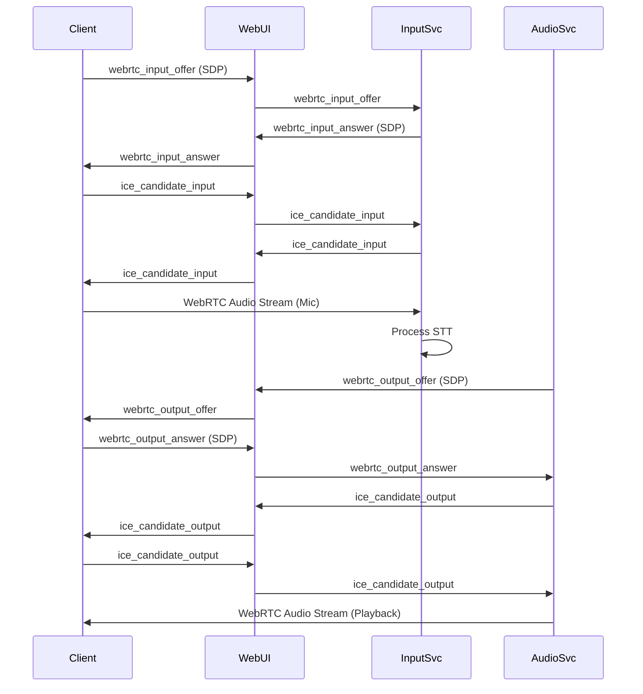

# WebRTC Audio Streaming Implementation Plan

## Current Implementation Analysis

The current audio handling uses WebSocket-based streaming via Socket.IO:

- **Input (Mic to STT)**: Browser captures audio with `getUserMedia`, processes to PCM16, sends chunks via Socket.IO to web-ui, which forwards to input-service for transcription.
- **Output (Mixer to Client)**: Mixer generates audio, sends PCM16 chunks via Socket.IO to web-ui, which broadcasts to clients for playback.

No WebRTC is currently implemented. This plan outlines adding WebRTC for lower latency, better quality, and native browser audio handling.

## Proposed WebRTC Architecture

Use WebRTC for peer-to-peer audio streaming with signaling over existing Socket.IO infrastructure.

### Components:
- **Client (Browser)**: Handles RTCPeerConnection for input (mic) and output (playback).
- **Input-Service**: Receives WebRTC audio stream from client, processes for STT.
- **Audio-Service (Mixer)**: Sends WebRTC audio stream to client for playback.
- **Web-UI**: Relays signaling messages between client and services.

### Signaling Flow:
1. Client creates offer for input/output, sends via Socket.IO to web-ui.
2. Web-ui forwards to appropriate service (input/audio).
3. Service creates answer, sends back via web-ui to client.
4. ICE candidates exchanged similarly.

## Detailed Implementation Steps

1. **Research and Dependencies** ✅
   - Use `aiortc` for Python WebRTC support.
   - Client uses native `RTCPeerConnection`.
   - Add `aiortc` to `services/input/requirements.txt` and `services/audio/requirements.txt`.
   - Update Dockerfiles to install dependencies.

2. **Client-Side Changes (session.js)** ✅
   - Replace Socket.IO audio chunk sending with WebRTC peer connection for mic input.
   - Add WebRTC peer connection for receiving audio output from mixer.
   - Handle signaling: create offers, exchange ICE candidates via Socket.IO.
   - Fallback to current method if WebRTC fails.

3. **Input-Service Changes (stt_server.py)** ✅
   - Integrate `aiortc` to accept WebRTC connections.
   - Receive audio track from client, decode to PCM16 for VAD/transcription.
   - Handle signaling events via Socket.IO.

4. **Audio-Service Changes (mixer.py)** ✅
   - Integrate `aiortc` to send WebRTC audio streams.
   - Basic structure in place; full real-time streaming needs custom audio source implementation.
   - Handle signaling for output stream.

5. **Web-UI Changes (app.py)** ✅
   - Add Socket.IO events for WebRTC signaling (offers, answers, ICE candidates).
   - Route messages between client and input/audio services.

6. **Testing and Optimization**
   - Test input stream: mic audio reaches STT accurately.
   - Test output stream: mixer audio plays in browser.
   - Measure latency improvements over WebSocket streaming.
   - Handle network issues, STUN/TURN if needed for NAT traversal.
   - Note: Full real-time WebRTC audio output requires implementing a custom AudioSource in aiortc to stream PCM data dynamically.

## Mermaid Diagram

## Benefits
- Lower latency due to direct peer connections.
- Better audio quality with Opus codec.
- Reduced server load (no chunk processing/forwarding).
- Native browser audio handling.

## Risks and Considerations
- WebRTC requires signaling server (using existing Socket.IO).
- NAT traversal may need STUN/TURN servers.
- Browser compatibility (modern browsers support WebRTC).
- Fallback mechanism to current WebSocket streaming if WebRTC fails.

## Next Steps
Review this plan and approve to proceed with implementation. Start with updating dependencies and client-side code.