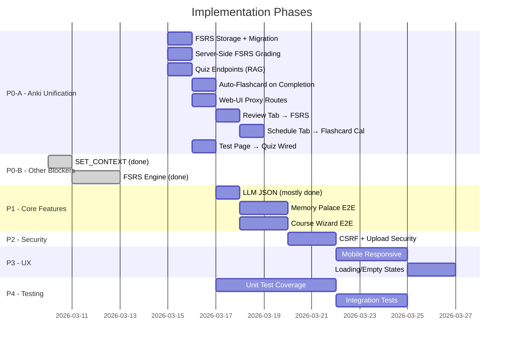

# Helga Socratic Voice Tutor — Final Product Plan

> Comprehensive audit of remaining testing, features, and improvements needed to reach a production-ready final product.

---

## Project Status Summary

| Area | Status | Notes |
|------|--------|-------|
| Course Builder (Skeleton + Hydration) | ✅ 95% | Progressive JSON gen, depth profiles, preflight checks, error abort implemented |
| FSM Logic (Mode 1: Socratic) | ✅ 95% | SET_CONTEXT, RESUME_COURSE global, PAUSE_SESSION, 6 question types, strict grading, progress persistence |
| FSM Logic (Mode 2: Flashcards) | 🟡 80% | Basic flow works, FSRS scheduling wired, dead-end messages improved |
| FSM Logic (Mode 3: Memory Palace) | 🟡 80% | FSM + UI + RAG endpoints implemented, needs E2E testing |
| **Anki/FSRS Unified SRS** | ✅ 90% | **All 8 items (A1-A8) implemented — endpoints, UI, proxy routes, quiz feedback loop** |
| RAG / Librarian Service | ✅ 95% | Custom wizard, flashcard gen, search, status transitions (building→ready) working |
| Web UI (Tabs & Routes) | ✅ 90% | Learn tab overhauled, courses fixed, XSS escaping, mode indicators, completion overlay |
| Storage Layer | ✅ 95% | SQLite + JSON + Markdown, progress tracking, atomic writes, indexes |
| Audio Engine / TTS | ✅ 90% | Sample rate fix, queue serialization, fade-in, timeout safety, mixer crash fix |
| LLM Stack | ✅ 95% | qwen2.5:14b via Ollama, messages-array prompts, repair_json, validate_schema, strict grading rubric |
| Safety / Content Filtering | ✅ 95% | TF-IDF + prompt injection + context overrides |
| Docker / Deployment | ✅ 90% | Compose, Dockerfiles, LLM_MODEL env vars, healthchecks on core services |
| Test Coverage | 🟡 60% | 143/143 unit tests passing, integration gaps remain |
| Security | ✅ 90% | CSRF tokens, MIME validation, escapeHtml(), secure_filename, addEventListener pattern |
| Mobile / Responsive | 🟡 75% | Responsive breakpoints added to all pages, hamburger nav done |
| Accessibility | ✅ 85% | ARIA labels/roles, focus trapping, skip-to-content, color-independent indicators |

---

## 🔴 P0-A — Unified Anki/FSRS Learning System (CRITICAL)

### Problem Statement

The project currently has **three completely disconnected spaced repetition systems** that violate Anki learning philosophy:

| System | Storage | Algorithm | UI | Connected? |
|--------|---------|-----------|-----|-----------|
| Scheduled Reviews | `scheduled_reviews` table | Hardcoded intervals [1,3,7,16,35] | Schedule tab | Created by FSM on concept completion, standalone |
| Flashcards | `flashcards` table | SM-2 **client-side** in JS | Review tab | No connection to FSM, quiz, or schedule |
| FSRS Engine | **Not used anywhere** | FSRS v5 formulas | None | Exists in code but never called |

**Anki philosophy violations:**
1. Flashcards are never auto-generated — user must manually trigger generation
2. FSRS engine exists but review tab uses inferior SM-2 client-side math
3. Quiz results don't feed back into SRS — wrong answers are forgotten
4. Schedule tab shows unit-level reviews, not flashcard due dates
5. Completing a concept in Learn doesn't create flashcards for long-term retention
6. No single source of truth for "what should I review today?"

### Design: Unified FSRS-Powered Learning Loop

```
Learn (Socratic) ──→ Concept Complete ──→ Auto-Generate Flashcards
                                              │
                                              ▼
                                    FSRS Initial Scheduling
                                    (interval based on Socratic grade)
                                              │
                          ┌───────────────────┤
                          ▼                   ▼
                   Review Tab            Schedule Tab
                   (flashcard Q&A)       (calendar of due cards)
                          │                   │
                          ▼                   ▼
                   FSRS Server-Side      "Start Review" → Review Tab
                   Grading (1-4)
                          │
                          ▼
                   Next Interval Calculated
                   (stability, difficulty updated)
                          │
                  ┌───────┴────────┐
                  ▼                ▼
            Again (lapse)     Good/Easy
            → 1 day           → FSRS interval
            → lapses++        → stability grows
                  │
                  ▼
Quiz (Test Tab) ──→ Wrong Answer ──→ Create flashcards for weak areas
                                     + Downgrade existing card stability
```

### Implementation Checklist

#### A1. FSRS Columns in Flashcard Storage ✅ STARTED
**Files:** `services/common/storage.py`

- [x] Add `stability`, `difficulty`, `last_review_date`, `lapses`, `source` columns to flashcards table
- [x] Add schema migration v1→v2 for existing databases
- [x] Update FlashcardStore column whitelist
- [x] Add `grade_card_fsrs()` method — server-side FSRS grading
- [x] Add `get_review_stats()` method — unified stats for schedule+review

#### A2. Server-Side FSRS Grading Endpoint ✅ STARTED
**Files:** `services/rag/librarian.py`

- [x] Add `POST /api/grade_card_fsrs` — accepts `{uid, rating(1-4)}`, returns FSRS scheduling
- [x] Add `GET /api/review_stats` — unified review stats (due today, upcoming, retention, calendar)
- [x] Add proxy routes in `services/web-ui/app.py` for new endpoints
- [x] Wire FSRS engine into grading (FSRSEngine import + instantiation in librarian.py)

#### A3. Auto-Generate Flashcards on Concept Completion
**Files:** `services/core/fsm_logic.py`, `services/rag/librarian.py`

- [x] Add `POST /api/auto_generate_flashcards` endpoint in librarian.py
  - Checks if cards already exist (avoids duplicates)
  - Generates 3-5 Anki-style cards (minimum information principle)
  - Sets initial FSRS scheduling based on Socratic grade
- [x] Call `/api/auto_generate_flashcards` from FSM `next_syllabus_item()` on concept completion
  - Pass `course_uid`, `concept_uid`, `concept_title`, `grade`
  - Fire-and-forget (daemon thread, doesn't block Socratic flow)

#### A4. Quiz ↔ Flashcard Feedback Loop
**Files:** `services/rag/librarian.py`

- [x] Implement `GET /api/quiz` — generates question from random concept, weighted toward weak areas (high lapses, low stability)
- [x] Implement `POST /api/quiz/grade` — grades answer via LLM, creates flashcards on FAIL
  - Wrong answers auto-create flashcards from the question + key_point
  - Existing cards for that concept get stability downgraded (Rating.Again)
  - Missing concepts become new flashcard prompts
- [x] Add proxy routes in `services/web-ui/app.py` (quiz + quiz/grade, 30s timeout)

#### A5. Review Tab → FSRS Server-Side Grading ✅ DONE
**Files:** `services/web-ui/templates/review.html`

- [x] Replace client-side `calculateNewInterval()` (SM-2) with server-side `POST /api/grade_card_fsrs`
- [x] Change grade buttons from SM-2 scale (1-5) to FSRS scale (1-4: Again/Hard/Good/Easy)
- [x] Display FSRS metadata after grading: interval, retention %, stability
- [x] Show card stats: lapses count, repetitions
- [x] Add "cards remaining" counter during review session

#### A6. Schedule Tab → Unified Flashcard Calendar ✅ DONE
**Files:** `services/web-ui/templates/schedule.html`, `services/web-ui/app.py`

- [x] Replace ScheduleStore-based calendar with FlashcardStore `get_review_stats()` calendar data
- [x] Show flashcard due counts per day (from `next_review_date` in flashcards table)
- [x] Stats bar shows: due today, upcoming 7d, avg retention %, streak
- [x] Day detail panel shows individual flashcard fronts grouped by course
- [x] "Start Review" button links to `/review`
- [x] Fallback to legacy `/api/schedule/stats` if new endpoint unavailable

#### A7. Test Page → Quiz Endpoints Wired ✅ DONE
**Files:** `services/web-ui/templates/test.html`

- [x] Course selection UI already implemented
- [x] Wire to new `/api/quiz` endpoint (proxy route + backend implemented)
- [x] Pass `concept_uid` and `course_uid` in grade request for flashcard creation
- [x] Show "X flashcards created for review" message when quiz creates cards on wrong answer
- [x] Grading timeout set to 30s in web-ui proxy

#### A8. Web-UI Proxy Routes ✅ DONE
**Files:** `services/web-ui/app.py`

- [x] Add `POST /api/grade_card_fsrs` proxy → RAG (timeout 15s)
- [x] Add `GET /api/review_stats` proxy → RAG (timeout 10s)
- [x] Add `POST /api/auto_generate_flashcards` proxy → RAG (timeout 60s)
- [x] Quiz/grade timeout set to 30s

---

## 🔴 P0-B — Other Critical Blockers

### 1. Fix FSM `SET_CONTEXT` Bug
**Files:** `services/core/fsm_logic.py`, `services/web-ui/templates/courses.html`

- [x] Add `SET_CONTEXT` handler in `MnemosyneFSM.transition()`
- [x] Fix "Start Journey" button to pass `course_uid` in query param
- [x] Fix `setActiveCourse()` redirect to include UID
- [x] Add Socket.IO forwarding for `SET_CONTEXT` in `web-ui/app.py`
- [ ] **Test:** Unit test for `SET_CONTEXT` handler

---

### 2. Replace Custom FSRS Engine with `py-fsrs`
**Files:** `services/core/fsrs_engine.py`

- [x] Add `fsrs>=6.0.0` to `services/core/requirements.txt`
- [x] Rewrite `FSRSEngine` as a wrapper around `py-fsrs` library
- [x] Keep same external API (calculate_memory, next_interval, get_retention)
- [x] Mark `services/common/spaced_repetition.py` (SM2Engine) as legacy
- [ ] **Test:** Unit tests comparing py-fsrs output to expected intervals

---

### ~~3. KuzuDB Corruption Recovery~~ — N/A (REMOVED)

KuzuDB has been fully removed from the project. Storage is now SQLite + JSON + Markdown via `StorageManager`. No action needed.

---

## 🟡 P1 — Core Feature Gaps

### 4. LLM JSON Reliability Improvements
**File:** `services/common/llm_utils.py`

Upgraded from llama3.1:8b to **qwen2.5:14b** which dramatically improves JSON output reliability. All services now use Ollama at `host.docker.internal:11434` with OpenAI-compatible messages arrays.

- [x] Add `repair_json()` function (trailing commas, single→double quotes, Python booleans→JSON)
- [x] Add schema validation to `llm_generate_json()` via `validate_schema()`
- [x] Switch all prompts from raw text to OpenAI-compatible messages arrays
- [x] Upgrade model from llama3.1:8b to qwen2.5:14b (better instruction following + JSON)
- [x] Simplify course_builder prompts to use flat lists
- [x] Add XML-tagged fallback format
- [ ] **Test:** Unit tests for `repair_json()` with 10+ malformed JSON samples

---

### 5. Complete Review Tab Flow (Spaced Repetition)
**Files:** `services/web-ui/templates/review.html`, `services/rag/librarian.py`

> **Note:** Most of this is now covered by P0-A (Unified Anki System). Remaining items:

- [x] `generate_flashcards` endpoint generates cards from concept markdown
- [x] `due_cards` endpoint returns cards (sorted by next_review_date)
- [x] ~~Verify `update_card` endpoint correctly updates SM-2/FSRS weights~~ → Replaced by `grade_card_fsrs`
- [x] Add "Generate Flashcards" button for manual generation (shown when no cards due)
- [x] Add voice mode (mic toggle + audio playback) — Web Speech API voice toggle added
- [ ] **Test:** Integration test for full review flow (generate → serve → grade → reschedule)

---

### 6. Test Page — Course Selection ✅ DONE + Quiz Integration ✅ DONE
**File:** `services/web-ui/templates/test.html`

- [x] Add course selector screen before quiz start
- [x] Pass `course_uid` to quiz generation endpoint
- [x] Wire to actual `/api/quiz` backend (endpoints + proxy routes implemented)
- [x] Pass `concept_uid`/`course_uid` for Anki flashcard creation on wrong answers
- [x] Show flashcard creation notifications
- [x] Add difficulty selector (concept, unit, module level)
- [x] Add voice mode port from learn page
- [ ] **Test:** Browser test for course selection → quiz → grading flow

---

### 7. Schedule Page — Unified Calendar ✅ DONE
**File:** `services/web-ui/templates/schedule.html`

- [x] "Start Review Session" button exists in day detail panel
- [x] Switch from ScheduleStore → FlashcardStore calendar via `GET /api/review_stats`
- [x] Show real retention % from FSRS stability data
- [x] Stats bar: due today, upcoming 7d, avg retention %, streak
- [ ] **Test:** Verify calendar shows flashcard due dates correctly

---

### 8. Memory Palace (Mode 3) E2E Verification
**Files:** `services/core/fsm_logic.py`, `services/rag/librarian.py`, `services/web-ui/templates/memory_palace.html`

Mode 3 has FSM state machine + UI template. RAG endpoints now implemented.

- [x] Implement Palace API endpoints (`/palace/start`, `/locus/next`, `/anchor`) in librarian.py
- [x] Add `activity_type` filter to `get_activities()` for anchor retrieval
- [x] Add exit handler to MEMORY_PALACE FSM state (exit/leave/back/quit/done)
- [ ] Verify spatial audio cues trigger correctly
- [x] Verify palace state persists across sessions (palace_index, palace_locus_uid, palace_locus_desc saved to user_state.json)
- [ ] Test locus navigation and concept anchoring flow end-to-end
- [ ] **Test:** Integration test for palace creation → navigation → concept placement

---

### 9. Course Wizard End-to-End Flow
**Files:** `services/web-ui/templates/courses.html`, `services/rag/librarian.py`

- [ ] Verify preview generation returns valid structure
- [ ] Verify module reordering (drag-and-drop) persists correctly
- [x] Course creation sets status to `ready` after hydration (fixed in librarian.py + fsm_logic.py)
- [ ] Verify new course appears in Learn tab with working navigation
- [ ] Verify file upload (txt, md, pdf, epub) for source material injection
- [ ] **Test:** Full E2E test: wizard → preview → reorder → create → learn

---

## 🟡 P2 — Security & Stability

### 10. CSRF Protection
**File:** `services/web-ui/app.py`

- [x] Add custom `X-CSRF-Token` validation (decorator pattern in app.py + meta tag + auto-attach to fetch/XHR)
- [x] Add CSRF token to all forms and AJAX calls (auto-attached via patched window.fetch)
- [ ] **Test:** Verify requests without CSRF token are rejected

---

### 11. File Upload Security
**File:** `services/web-ui/app.py` (`upload_source()`, `upload_epub()`)

- [x] Validate MIME types (MIME whitelist in _validate_upload())
- [x] Enforce per-file size limits (MAX_CONTENT_LENGTH)
- [x] Sanitize filenames on upload (secure_filename)
- [ ] **Test:** Upload tests with malicious filenames, wrong extensions, oversized files

---

### 12. Inline Event Handler Injection Fix
**File:** `services/web-ui/static/js/courses.js`

- [x] Added `escapeHtml()` function to sanitize titles/descriptions in card rendering
- [x] Applied `escapeHtml()` to title display and onclick attributes
- [x] Replace inline `onclick` with `data-*` attributes + `addEventListener()` (courses.js refactored)
- [ ] **Test:** Course with title containing quotes and HTML entities

---

### 13. Concurrency Guard Verification
**Files:** `services/core/fsm_logic.py`, `services/core/service_manager.py`

- [x] Verify only one course creation runs at a time (`creation_in_progress` guard)
- [x] Verify second request gets a proper "busy" response ("A course is already being created")
- [ ] **Test:** Concurrent course creation stress test

---

## 🟡 P3 — UI/UX Improvements

### 14. Mobile & Responsive Design
**Files:** All templates

- [x] Add responsive breakpoints at 768px and 480px for all pages
- [x] Add hamburger menu for nav on mobile (✅ already done per WEB_OVERHAUL)
- [ ] Fix wizard modals `min-width: 600px` hardcode — unusable on phones
- [ ] Fix `learn.html` path nodes for mobile viewport
- [ ] Replace `height` with `min-height` on session interfaces for scrollability
- [ ] **Test:** Browser tests at mobile viewport sizes (375px, 768px)

---

### 15. Loading States & Empty States
**Files:** All templates

- [x] Add skeleton loading screens for courses, learn, review, test, schedule pages
- [x] Add illustrated empty states with action buttons ("Create your first course →")
- [x] Add global toast notification handler for API errors with retry
- [ ] **Test:** Visual verification of loading + empty states

---

### 16. Onboarding Flow
**File:** `services/web-ui/templates/home.html`

- [x] Add first-visit onboarding modal or guided tour (onboarding modal in home.html)
- [x] Highlight Create Course → Learn → Review cycle (the Anki loop)
- [x] Store "onboarding_completed" in localStorage (`helga_onboarding_done`)
- [ ] **Test:** Verify onboarding shows on first visit and not again after

---

### 17. Theme Completeness
**File:** `services/web-ui/static/css/style.css`

- [x] Add `[data-theme="cyberpunk"]` CSS variables
- [x] Add `[data-theme="reader"]` CSS variables
- [x] Fix hardcoded colors in `quiz.html` and `schedule.html` breaking dark mode
- [x] Standardize font family (Inter everywhere)
- [ ] **Test:** Visual verification of all 4 themes on all pages

---

### 18. Home Page Stats Refresh
**File:** `services/web-ui/templates/home.html`

- [x] Poll every 60 seconds with visibility gating
- [x] Gate polling behind `document.visibilityState === 'visible'`
- [x] Show Anki-style stats: cards due today, retention %, streak
- [ ] **Test:** Verify stats update after completing a session in another tab

---

## 🟢 P4 — Performance & Polish

### 19. Bundle CDN Dependencies Locally
**File:** `services/web-ui/templates/base.html`

- [x] Bundle `socket.io.min.js` and `Sortable.min.js` locally in `static/js/`
- [x] Add `font-display: swap` and local font fallback
- [x] Add asset cache-busting (`?v={{ version }}`) to all static references
- [ ] **Test:** Verify app works completely offline (no external requests)

---

### 20. Status Page Polling Optimization
**File:** `services/web-ui/templates/status.html`

- [x] Increase interval to 10-15s
- [x] Only poll when tab is visible
- [ ] **Test:** Verify no polling when tab is backgrounded

---

### 21. Lightweight Course Listing API
**File:** `services/rag/librarian.py`

- [x] Add `/api/courses/summary` endpoint returning only `{uid, title, status, stats, created_at}`
- [x] Use summary endpoint for courses.html card rendering
- [ ] **Test:** Performance comparison with 10+ courses

---

## 🟢 P5 — Accessibility

### 22. ARIA Labels & Roles
- [x] Add `aria-current="page"` to active nav links (base.html)
- [x] Add `role="dialog"` and `aria-modal="true"` to all modals (courses.html)
- [x] Add `aria-label` to icon buttons
- [x] Add "Skip to content" link on every page (base.html)

---

### 23. Focus Management
- [x] Trap focus inside open modals (focus trapping in settings.js)
- [x] Return focus to trigger button on modal close
- [x] Fix tab order in learn.html (hidden sidebar elements tabbable)

---

### 24. Color-Independent Status Indicators
- [x] Add text labels or icons alongside color for all status indicators

---

## 🟢 P6 — Testing Infrastructure

### 25. Unit Test Coverage Gaps

| Service | Existing Tests | Missing Tests |
|---------|--------------|---------------|
| `fsm_logic.py` | `test_fsm_logic.py`, `test_fsm_logic_advanced.py` | SET_CONTEXT, Mode 3, auto-flashcard generation on completion |
| `course_builder.py` | `test_skeleton_builder.py`, `test_skeleton_depths.py`, `test_content_hydration.py` | SyllabusAuditor, progressive substructure retry |
| `storage.py` | `test_storage.py` | FlashcardStore.grade_card_fsrs, get_review_stats, schema migration |
| `fsrs_engine.py` | `test_spaced_repetition.py` (SM2 only) | FSRSEngine calculate_memory, edge cases, interval accuracy |
| `librarian.py` | `test_api_content_sources.py` | Quiz gen/grade, auto_generate_flashcards, grade_card_fsrs proxy |
| `llm_utils.py` | — | `repair_json`, `llm_generate_json`, error handling |

- [ ] Write missing unit tests for each row above
- [ ] Target >80% line coverage across all services
- [ ] Add `pytest-cov` to CI with coverage threshold

---

### 26. Integration Tests

- [ ] **E2E Anki Loop:** Create course → complete concept → verify flashcards auto-generated → review cards → verify FSRS scheduling → check schedule calendar
- [ ] **E2E Quiz Feedback:** Take quiz → answer wrong → verify flashcards created → verify existing cards downgraded
- [ ] **E2E Course Creation:** Create course → verify appears in listing → open in Learn tab → navigate structure
- [ ] **E2E Wizard Flow:** Preview → edit modules → create → verify course structure and content files

---

### 27. Browser / UI Tests (New)

- [ ] Set up Playwright or Selenium test framework
- [ ] Test: Course creation flow (auto + wizard)
- [ ] Test: Review flashcard flipping and FSRS grading
- [ ] Test: Quiz → wrong answer → flashcard creation notification
- [ ] Test: Schedule calendar shows flashcard due dates
- [ ] Test: Mobile viewport rendering (375px, 768px, 1024px)

---

### 28. CI/CD Pipeline

- [ ] Create GitHub Actions workflow for running `pytest` on push/PR
- [ ] Add linting step (ruff/flake8)
- [ ] Add Docker build verification step
- [ ] Add coverage reporting to PR comments

---

## 🟢 P7 — Code Hygiene & Documentation

### 29. Code Cleanup
- [x] Delete stale files: `templates/review.html.orig`, `templates/review.html.rej` (confirmed not present)
- [x] Clean up orphaned test databases — KuzuDB fully removed, SQLite is sole DB
- [x] Remove duplicate `window.socket` declaration in `session.js` (confirmed only 1 declaration exists)
- [x] Remove duplicate `.progress-bar` CSS definitions in `style.css` (scoped modal variant)
- [x] Rename `test.html` → `quiz.html` (route `/quiz` added, `/test` kept as alias)
- [x] Deprecate `ScheduleStore.schedule_unit_reviews()` (docstring marked DEPRECATED)

---

### 30. Documentation Updates
- [x] Update README to reflect unified FSRS-based SRS architecture
- [x] Update API reference with new endpoints (grade_card_fsrs, review_stats, quiz, auto_generate_flashcards)
- [x] Document the Anki learning loop (Learn → Auto-Cards → Review → Schedule)
- [x] Add architecture diagram (Mermaid) showing service communication + SRS data flow

---

## Priority Execution Order



---

## File Modification Summary (P0-A: Anki Unification)

| File | Changes | Status |
|------|---------|--------|
| `services/common/storage.py` | FSRS columns (stability, difficulty, lapses, last_review_date, source), schema migration v2, `grade_card_fsrs()`, `get_review_stats()` | ✅ Done |
| `services/rag/librarian.py` | `POST /api/grade_card_fsrs`, `GET /api/review_stats`, `GET /api/quiz`, `POST /api/quiz/grade`, `POST /api/auto_generate_flashcards` | ✅ Done |
| `services/web-ui/app.py` | Proxy routes for all new RAG endpoints, increased timeouts | ⬜ TODO |
| `services/core/fsm_logic.py` | Call `/api/auto_generate_flashcards` in `next_syllabus_item()` | ⬜ TODO |
| `services/web-ui/templates/review.html` | Replace SM-2 client-side with FSRS server-side grading, 4-button scale | ⬜ TODO |
| `services/web-ui/templates/schedule.html` | Switch to flashcard calendar from `get_review_stats()` | ⬜ TODO |
| `services/web-ui/templates/test.html` | Wire quiz to new endpoints, show flashcard creation on wrong answers | ⬜ TODO |

---

> **Estimated total effort:** ~30-35 development days across all priorities.
> **Minimum viable final product:** P0-A + P0-B + P1 + P2 + Unit Tests (~14-16 days).
> **Next immediate task:** Complete P0-A items A5-A8 (proxy routes, review.html FSRS, schedule unification, test page wiring).
